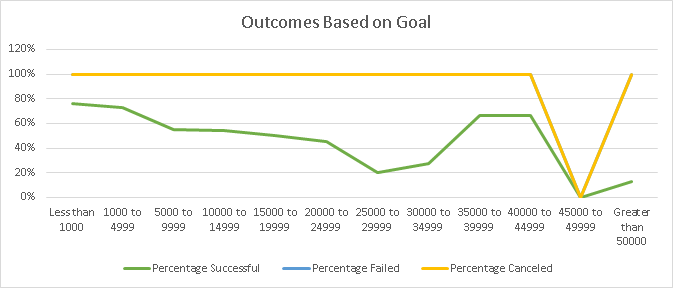
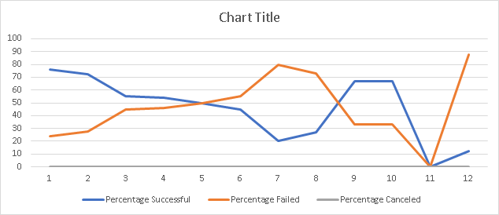
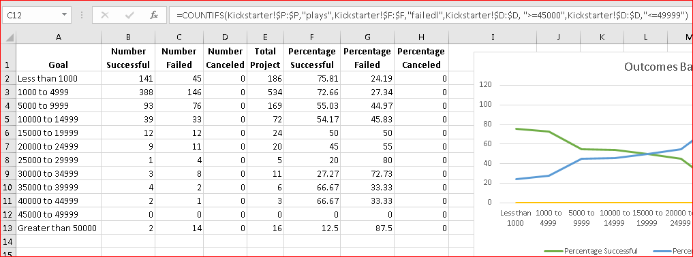
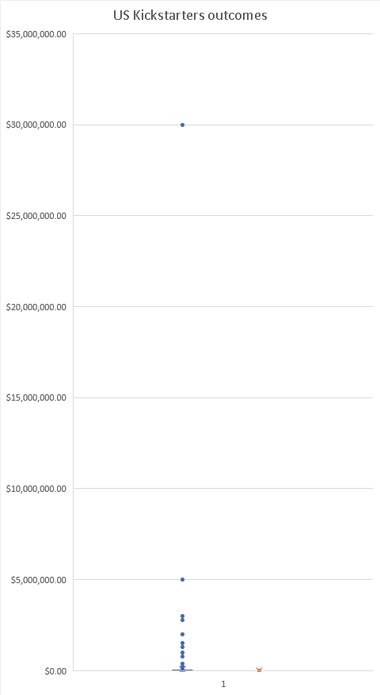
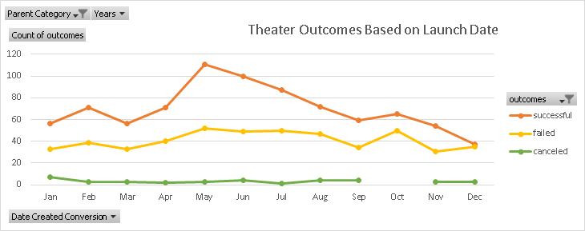
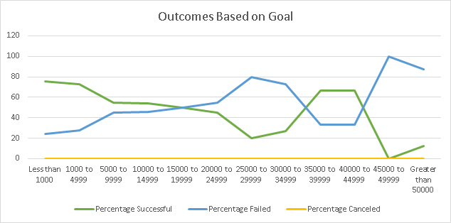

#**Kickstarting with Excel**
##**Overview of Project**
In this project, we are using Excel data analysis tools to help Louise with planning her fundraising project. Louise is starting up a crowdfunding campaign for her play *Fever*. Her initial budget estimation is $10000.
###**Purpose**
Using Excel, we have organized, sorted and analysed the Kickstarter dataset to specify some of the factors that may impact the success of this fundraising project. The dataset contains different factors such as the goal and pledged amounts, deadlines and launched dates, and categories of more than 4000 fundraising projects from all around the world.
##**Analysis and Challenges**
As the Kickstarter dataset demonstrates the results for many different fundraising projects from different categories and countries, we needed to narrow down and filter the data in several ways to get a better demonstration of the analysis. We used the tools such as Filters, sorting values, creating Pivot tables and Pivot charts to measure data in several ways. Following images show some of the data evaluations we have done:
###1. Analysis of Outcomes Based on Launch Date: Here we used Pivot Table and Pivot Chart to filter and analyse the outcomes data within Theater category based on the Launched date. According to the table, more than half of the projects in this parent category have been successful, the number of failed ones has been about half of the successful (approximately %25 of the total), and the failed projects include less than %10 of the total.
[Theater Outcomes by Launch Date](Kickstarter_Challenge.xlsx)
###2. Analysis of Outcomes Based on Goals: To create this table and the chart, we used `COUNTIFS` formula to calculate the number and percentage of *successful*, *failed*, and *canceled* outcomes in the *Plays* subcategory. In order to get a better understanding of the dependence of resulted outcome on the goal amount, we classified the goals based on their amounts. Interestingly, the number of the canceled projects in *plays* has been zero at all times. The successful and failed  ones fluctuated irregularly among the different amounts.
[Outcomes Based on Goals](Kickstarter_Challenge.xlsx)
###**Challenges and Difficulties Encountered**
One of the challenges in this project was reassuring the formulae and the charts are displaying the correct results.---The image below is an example where the chart is not showing the correct amounts of data, although the formulae seemed correct and the table did not give any errors. Based on the table the canceled projects were zero within all the goal categories and the subcategory *plays*, there were some failed projects as well. However, the chart displays the percentage for the *canceled* projects has been 100% for all the goal amounts in the *plays* subcategory. In addition, the *failed* percentage is not displayed at all on the chart.

###The reason for the problem was selecting incorrect type of chart. By comparing this chart with the correct one, and changing the type of the chart, it displayed the correct rates.

###However, it seemed there was another issue going on. The problem was getting zero percent in *failed* outcomes under the *45000 to 49999* category, while, based on the dataset, the value for this cell should be 1 which results in %100 of the total projects. Hence, I needed to make sure the formula in that specific cell is correct. By checking the formula, I found a typographical error in the word *failed*. 

###In analysing large datasets, it is crucial to consider mostly the factors that help us to get a better understanding of the analysis. For instance, there were many different categories and subcategories in this dataset. We needed to make sure the ones that we are using in our analysis, can give a clear idea to Louise for her further estimations and setting a realistic goal.
Often, and as in this dataset, there are outliers that impact the average and the statistics that we are using, while they are irregular cases. For instance there were many projects that showed the set goal was less than $10 whereas the pledged amount was more than $5000. To find the outlier values, we used a Plot Box chart where these values are more distinct.

##**Results**
###-What are two conclusions you can draw about the Outcomes based on Launch Date?
By looking into this chart, we conclude that:
The projects have had more success between the months of April to August, whereas the failed projects have been slightly fluctuating during these months. In addition, based on the chart, the successful projects have had the most percentage at all times, except in December when the successful and failed ones have an equal percentage.
No project has been canceled from September to November. Additionally, the percentage of the canceled projects has always been less than %10 in this category. This shows the projects in this category have been mostly launched.

###-What can you conclude about the Outcomes based on Goals?
As displayed in the chart below, the number of the successful outcomes has significantly been higher for the goals between 1000 to 4999 than the other categories, however the percentage of success has been higher when the goal has been less than 1000. Based on Louise's initial budget estimation which is $10000, we need to consider the success percentage of the goals in the 10000 to 14999 category. This means the success probability of a goal of $10000 is about %50 and there is a chance of %50 that Louise fundraising project will not succeed.

###-What are some limitations of this dataset?
The high number of the outliers that are found in *Plays* subcategory can impact crucially the average and skew the data.
Each country has its own currency which may indirectly impact the results.
The dataset does not provide any information whether the topic of the play has been a determining factor in success of the project.

###-What are some other possible tables and/or graphs that we could create?
What subcategory under *Theater* category is more popular and has had more successful fundraising projects.
Checking what percentage of the projects have succeeded before the deadline arrives.
